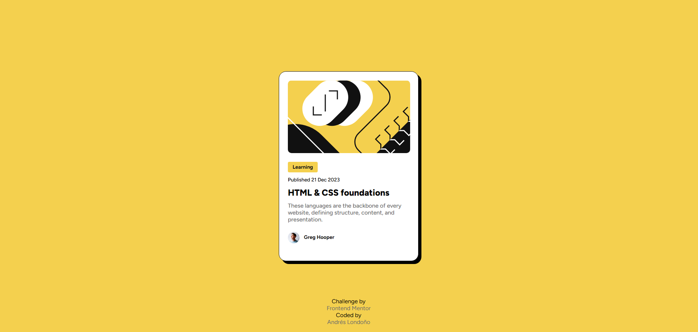

# Frontend Mentor - Blog preview card solution

This is a solution to the [Blog preview card challenge on Frontend Mentor](https://www.frontendmentor.io/challenges/blog-preview-card-ckPaj01IcS). Frontend Mentor challenges help you improve your coding skills by building realistic projects. 

## Table of contents

- [Frontend Mentor - Blog preview card solution](#frontend-mentor---blog-preview-card-solution)
  - [Table of contents](#table-of-contents)
  - [Overview](#overview)
    - [Screenshot](#screenshot)
    - [Links](#links)
  - [My process](#my-process)
    - [Built with](#built-with)
    - [What I learned](#what-i-learned)
    - [Useful resources](#useful-resources)
  - [Author](#author)

**Note: Delete this note and update the table of contents based on what sections you keep.**

## Overview


### Screenshot




### Links

- Solution URL: [Github](https://github.com/andreslondono00/blog-preview-card-main)

## My process

### Built with

- Semantic HTML5 markup
- CSS custom properties
- Flexbox
- CSS Grid

### What I learned

I learned how to use the box-shadow and add color to the container borders

```css
.container {
  background-color: white;
  width: 384px;
  height: 522px;
  padding: 24px;
  border-radius: 20px;
  box-sizing: border-box;
  border: 1px solid hsl(0, 0%, 7%);
  box-shadow: 8px 8px 0px black;
}
```

### Useful resources

- [Example resource 1](https://developer.mozilla.org/es/docs/Web/CSS/box-shadow) - I learned how to use the box-shadow and to color the container borders

## Author

- Frontend Mentor - [@andreslondono00](https://www.frontendmentor.io/profile/andreslondono00)


